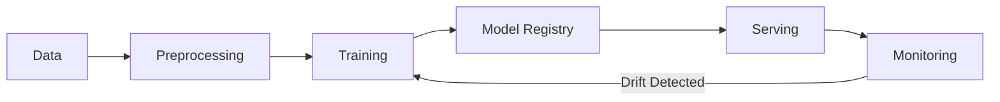

# Assets - Diagrams

This directory contains diagrams used throughout the course.

## Naming Convention

```
lecture-X-Y-description.png
section-XX-description.png
architecture-component.png
```

## Diagrams Needed

### Section 1 - Introduction
- [ ] lecture-1-4-diagram.png - End-to-end ML system architecture
- [ ] lecture-1-6-diagram.png - Team roles and responsibilities
- [ ] lecture-1-8-diagram.png - Project preview architecture

### Section 3 - ML Lifecycle
- [ ] lecture-3-2-diagram.png - CRISP-DM lifecycle
- [ ] lecture-3-4-diagram.png - MLOps vs DevOps comparison
- [ ] lecture-3-5-diagram.png - Online vs batch systems

### Section 4 - Project
- [ ] lecture-4-4-diagram.png - High-level project architecture
- [ ] lecture-4-5-diagram.png - Company stack integration

### Section 5 - Data Engineering
- [ ] lecture-5-1-diagram.png - Data storage types
- [ ] lecture-5-2-diagram.png - Ingestion patterns
- [ ] lecture-5-5-diagram.png - Feature store architecture

### Section 6 - Experimentation
- [ ] lecture-6-1-diagram.png - Reproducibility ladder
- [ ] lecture-6-4-diagram.png - Experiment tracking flow
- [ ] lecture-6-5-diagram.png - MLflow architecture

### Section 7 - Packaging
- [ ] lecture-7-3-diagram.png - FastAPI architecture
- [ ] lecture-7-4-diagram.png - Docker concepts
- [ ] lecture-7-5-diagram.png - Multi-stage Docker build

### Section 8 - Versioning
- [ ] lecture-8-1-diagram.png - Version dependencies
- [ ] lecture-8-3-diagram.png - Model registry flow
- [ ] lecture-8-4-diagram.png - Model state transitions

### Section 9 - Pipelines
- [ ] lecture-9-2-diagram.png - DAG concepts
- [ ] lecture-9-3-diagram.png - Orchestrator comparison
- [ ] lecture-9-4-diagram.png - Training pipeline design

### Section 10 - CI/CD
- [ ] lecture-10-1-diagram.png - CI/CD basics
- [ ] lecture-10-5-diagram.png - Deployment stages
- [ ] lecture-10-6-diagram.png - Blue/green deployment

### Section 11 - Deployment
- [ ] lecture-11-1-diagram.png - Serving patterns
- [ ] lecture-11-4-diagram.png - Kubernetes concepts
- [ ] lecture-11-5-diagram.png - Model serving frameworks

### Section 12 - Monitoring
- [ ] lecture-12-1-diagram.png - Monitoring layers
- [ ] lecture-12-3-diagram.png - Drift types
- [ ] lecture-12-7-diagram.png - Feedback loop

### Section 13 - Governance
- [ ] lecture-13-1-diagram.png - Access control
- [ ] lecture-13-4-diagram.png - Approval workflow

### Section 14 - Capstone
- [ ] lecture-14-1-diagram.png - Final architecture
- [ ] lecture-14-3-diagram.png - Full pipeline flow

## Tools for Creating Diagrams

1. **draw.io / diagrams.net** - Free, powerful diagramming
2. **Excalidraw** - Hand-drawn style, great for concepts
3. **Mermaid** - Code-based diagrams (embeddable in Markdown)
4. **Lucidchart** - Professional diagrams
5. **Figma** - Design-quality diagrams
6. **PlantUML** - Code-based, good for sequences

## Example Mermaid Diagram



## Style Guidelines

- **Format**: PNG or SVG preferred
- **Resolution**: Minimum 1200px wide
- **Background**: Transparent or white
- **Colors**: Consistent with course branding
- **Text**: Large enough to read on video
- **Annotations**: Clear labels and legends
